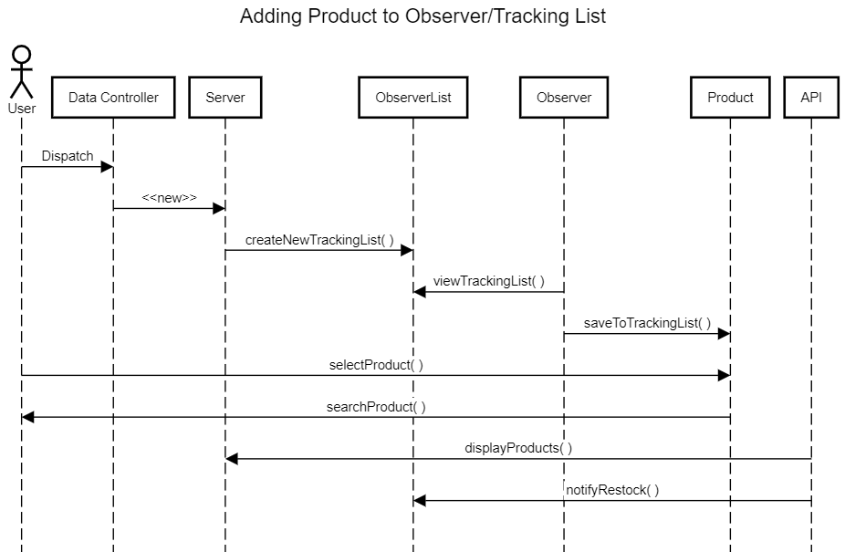
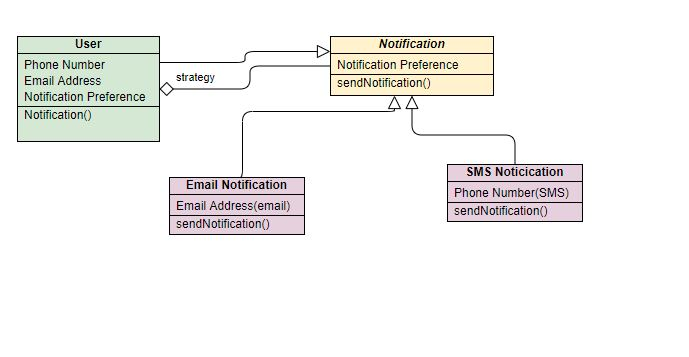
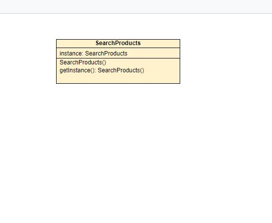

# D.5 Design 

Grading: 30 points
In this deliverable, you should describe the architectural design of your system. Structure your
deliverable using the following sections. See the “Team Project Instructions” for details about
formatting. Check the lecture materials and perform additional research to produce a highquality deliverable. As usual, if you have any questions, let me know.

## 1. Description
Our system will be kept relatively simple and straight forward. Through our web interface, the customer will be able to browse products that they would like to be selected to be notified for. When the customer finds their desired products they will then be able to select the item and choose their preference of notification, either SMS or email. Depending on which is selected, the clients information and the product they selected will be stored in our database. When the time comes that the product they selected is back in stock, we can pull their information from our data base and send them their specified notification.

## 2. Architecture

There are 2 primary modules that are utilized for our website. The website module manages two other packages for requests and responses. The lines represent dependency on one class for another. The dotted lines represent access between classes as well as dependency. Each of the classes serves in response to the request even if not directly. This format can later be scaled up to include more APIs to search from.

## 3. Class diagram

## 4. Sequence diagram

## 5. Design Patterns
Split this section into 2 subsections. For each subsection, present a UML class diagrams
showing the application of a design pattern to your system (a different pattern for each
section). Each class diagram should contain only the classes involved in the specific pattern
(you don’t need to represent the whole system). Choose patterns from two different
categories: Behavioral, Structural, and Creational. You are not limited to design patterns
studied in class.

Design Pattern 1(Behavioral)(Strategy Method): This pattern allows for the sendNotification to be sent at runtime. (Notification is selected with the desired preference, Email or SMS).

Design Pattern 2(Creational) (Singleton): This pattern allows for only one instance of the SearchProducts.

Design Pattern 1. Notification: https://github.com/colinvwood/AlertX/blob/main/code/notification.txt

Design Pattern 2. SearchProducts: https://github.com/colinvwood/AlertX/blob/main/code/searchProducts.txt

Grading: 6 points (3 pts each pattern). Criteria: Correct use of the design pattern as described
in the literature (1.5 pt); Adequate choice of the design pattern (0.5 pt); Adequate
implementation of the design pattern (1 pt).

## 6. Design Principles

Our source code doesn't strictly implement many object-oriented programming techniques due to the web-app status of our project and the fact that only a groundwork amount of coding in a full-fledged programming language (javascript) has been done. However, other aspects of the structure of our project do adhere to the SOLID principles. 
* Our directory structure demonstrates the *single responsibility principle*: the routes directory deals with the logic of routing requests to our site, the views directory stores the webpages that are visible to the client, our stylesheets directory stores all the css, and so on--each has only its one responsibility.
* By using Express on top of Node.js as the main backend frameworks we've adhered somewhat to the *open-closed principle*: instead of using a simpler webserver (such as the http-server that ships with Node) or coding our own, either of which would have been more error-prone, we invested upfront in learning and using these technologies which are extensible but which we do not need to modify.
* When users visit our site and they want to search for an item to track, they may want to either scroll through options or be able to search directly (via a text search interface). By seprating the search interface from the catalogue (scrolling) interface, we will implement the *interface segregation principle*.

